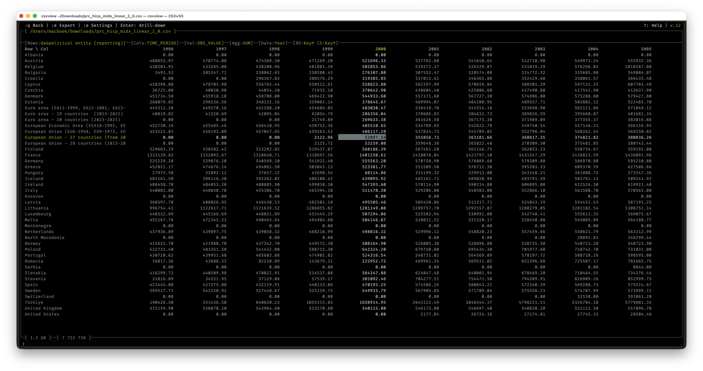
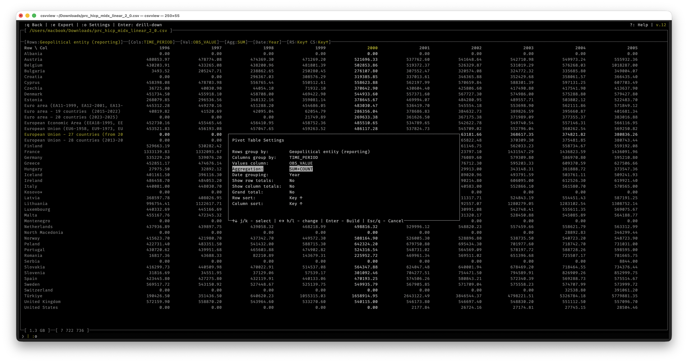
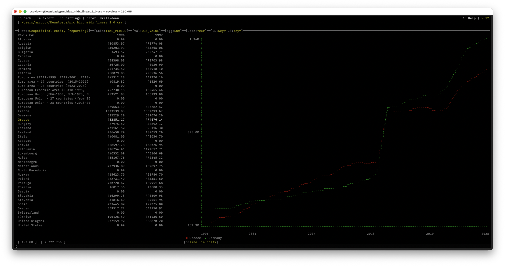

# csvview

**Fast interactive CSV viewer and editor for the terminal.**
No Python. No Electron. No dependencies — just C and ncurses.

[](LICENSE)
[](#install)
[](#build-from-source)







---

## Why csvview?

Most terminal CSV tools either lack interactivity (miller, xsv, csvkit) or require a heavy runtime (VisiData needs Python, TAD needs Electron). csvview is a **native C binary** — instant startup, minimal memory, works on any server over SSH.

| Feature | csvview | VisiData | sc-im | csvlens |
|---|:---:|:---:|:---:|:---:|
| Interactive TUI | ✅ | ✅ | ✅ | ✅ |
| Edit cells | ✅ | ✅ | ✅ | ❌ |
| Filter + sort | ✅ | ✅ | ✅ | filter only |
| Pivot tables | ✅ | ✅ | ❌ | ❌ |
| Graphs in terminal | ✅ | ASCII only | GNUPlot req. | ❌ |
| Computed columns | ✅ | Python expr | formulas | ❌ |
| No runtime needed | ✅ | ❌ Python | ✅ | ✅ |
| Row limit | 10M | ~5M (slow) | **65K** | RAM |
| Single binary | ✅ | ❌ | ✅ | ✅ |

---

## Install

### Build from source

```sh
git clone https://github.com/daniil-khanin/csvview.git
cd csvview
make
sudo make install        # installs to /usr/local/bin + man page
```

Requires: `clang` (or `gcc`), `ncurses` (pre-installed on macOS and most Linux distros).

### macOS (Homebrew)

```sh
brew tap daniil-khanin/csvview
brew install csvview
```

---

## Quick start

```sh
csvview data.csv          # open a CSV file
csvview data.tsv          # TSV auto-detected
csvview --sep=\; data.csv # custom delimiter
csvview                   # recent files picker
```

**Essential keys:**

| Key | Action |
|---|---|
| Arrows / `hjkl` | Move cursor |
| `Shift+F` | Filter (e.g. `revenue > 1000 AND status = paid`) |
| `[` / `]` | Sort ascending / descending |
| `d` | Column statistics (sum, mean, median, histogram) |
| `p` | Pivot table |
| `g` | Graph for current column |
| `Enter` | Edit cell |
| `:N` | Go to row N |
| `?` | Full help |

---

## Features

### Navigation & display
- Vim-style keys (`hjkl`) + arrow keys
- `PageUp`/`PageDown`, `Home`/`End`, `:N` / `Ctrl+G` to jump to row by number
- Freeze columns (`z`, `:fz N`) — pinned during horizontal scroll
- Hide/show columns (`X` in column settings)
- Column width adjustment (`w`/`W`, `A` for auto-fit)
- File history picker (`csvview` with no arguments)

### Filtering
- Advanced syntax: `revenue > 500 AND status = paid`
- Date range matching: `date >= 2026-01`
- Negation: `! cohort = 2016-04`
- Quick filter from current cell: `:fq`, `:fqn`, `:fqo`, `:fqu`
- Save/load filters (`:fs` / `:fl`) — stored in `<file>.csvf`

### Sorting
- Sort by any column ascending/descending (`[` / `]`)
- Works correctly with active filters
- Saved in `.csvf` alongside filter settings

### Editing
- Edit any cell (`Enter`)
- Add column left/right (`:cal` / `:car`)
- Delete column (`:cd`)
- Rename column (`:cr`)
- Delete row (`:dr N`)
- Save file (`s`)
- Reload from disk (`Ctrl+R`) — keeps filter and sort

### Computed columns
Fill a column by formula:
```
:cf price * qty
:cf round((revenue - cost) / revenue * 100, 2)
:cf if(qty > 0, revenue / qty, 0)
:cf col_pct(revenue)           # % of filtered total
:cf col_rank_all(score)        # rank across whole file
```
Functions: `round`, `abs`, `floor`, `ceil`, `mod`, `pow`, `if`, `empty`
Aggregates (filter): `col_sum`, `col_avg`, `col_min`, `col_max`, `col_count`, `col_median`, `col_percentile`, `col_stddev`, `col_var`, `col_rank`, `col_pct`
Aggregates (whole file): same with `_all` suffix

### Pivot tables
- Group by any row/column combination
- Aggregations: SUM, AVG, COUNT, MIN, MAX, UNIQUE COUNT
- Multi-aggregates: SUM+COUNT, SUM+AVG, MIN+MAX, etc. shown as sub-columns
- Row/column totals and grand total
- Sort by key or value (ascending/descending)
- Date grouping: month / quarter / year
- **Drill-down**: `Enter` on any cell → main table filtered by that cell's values
- Export to CSV (`:e`)

### Graphs
- Line, bar, and dot chart types
- Linear and log scale
- Cursor mode — scroll through data points with value display
- Jump to min/max with `m`/`M`
- Anomaly highlighting (values > 3σ)
- Date column as X axis (`:gx <column>`)
- **Pivot graph**: `G` in pivot mode splits screen — table on left, chart on right

### Column statistics (`d`)
- Numeric: sum, mean, median, mode, min/max, stddev, top-10 values + histogram
- Date: distribution by month/quarter/year + histogram

### Multi-file operations
- **Concat** (`--cat`): merge multiple CSVs, adds source-filename column
- **Split** (`--split --by=<col>`): split one CSV into N files by column value

### File formats
- CSV (`,`), TSV (`.tsv` → auto-detected), PSV (`.psv` → auto-detected)
- Custom delimiter: `--sep=<char>` (e.g. `--sep=\;`)
- European decimal separator (`,`) handled everywhere

---

## Command reference

```
:N              Go to row N (1-based)
:e [file]       Export current view to CSV
:dr N           Delete row N
:cr name        Rename current column
:cal [name]     Add column to the LEFT of current
:car [name]     Add column to the RIGHT of current
:cf <formula>   Fill column by formula
:cd name        Delete current column
:cs [file]      Export current column to CSV
:fz N           Freeze first N columns
:fs             Save current filter
:fl             Show saved filters
:fq             Quick filter: current cell = value (AND)
:fqn            Quick filter: current cell != value (AND)
:fqo            Quick filter: current cell = value (OR)
:fqu            Quick filter: reset and apply
```

---

## Key bindings

```
Arrows / hjkl       Move cursor
PageUp/PageDown     Scroll one page
Home/End            First/last row
Ctrl+G              Go to row (prompts)
/                   Search
n / N               Next/previous result
Shift+F             Advanced filter
f                   Quick filter (legacy syntax)
Enter               Edit cell
s                   Save file
Ctrl+R              Reload from disk
t                   Column settings
w / W               Increase/decrease column width
A                   Auto-fit column width
[ / ]               Sort ascending/descending
r / R               Reset sort
z                   Freeze/unfreeze up to current column
X (in t)            Hide/show column
d / D               Column statistics
p                   Pivot table
P                   Pivot table (always open settings)
g / G               Graph for current column
?                   Help
q / Esc             Quit
```

---

## Build & install

```sh
make              # build ./csvview
make install      # install to /usr/local/bin and /usr/local/share/man/man1/
make uninstall    # remove installed files
```

Custom prefix:
```sh
make install PREFIX=/opt/homebrew
```

---

## License

MIT — see [LICENSE](LICENSE).
