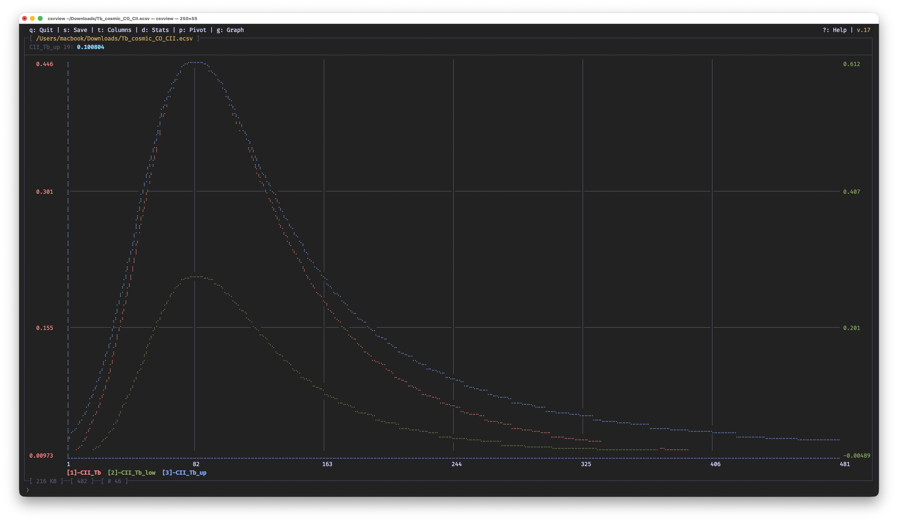
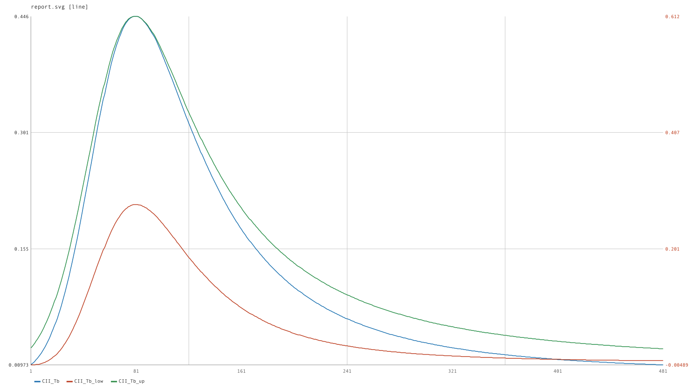

# csvview

**Fast interactive CSV viewer and editor for the terminal.**
No Python. No Electron. No dependencies — just C and ncurses.

[](LICENSE)
[](#install)
[](#build-from-source)







---

## Why csvview?

Most terminal CSV tools either lack interactivity (miller, xsv, csvkit) or require a heavy runtime (VisiData needs Python, TAD needs Electron). csvview is a **native C binary** — instant startup, minimal memory, works on any server over SSH.

| Feature | csvview | VisiData | sc-im | csvlens |
|---|:---:|:---:|:---:|:---:|
| Interactive TUI | + | + | + | + |
| Edit cells | + | + | + | — |
| Filter + sort | + | + | + | filter only |
| Pivot tables | + | + | — | — |
| Computed columns | + | Python expr | formulas | — |
| 50M+ row files | + | slow | — | + |
| No runtime needed | + | — Python | + | + |
| Single binary | + | — | + | + |

---

## Install

### Build from source

```sh
git clone https://github.com/daniil-khanin/csvview.git
cd csvview
make
sudo make install        # installs to /usr/local/bin + man page
```

Requires: `clang` (or `gcc`), `ncurses` (pre-installed on macOS and most Linux distros).

### macOS (Homebrew)

```sh
brew tap daniil-khanin/csvview
brew install csvview
```

---

## Quick start

```sh
csvview data.csv          # open a CSV file
csvview data.tsv          # TSV auto-detected
csvview --sep=\; data.csv # custom delimiter
csvview                   # recent files picker
```

**Essential keys:**

| Key | Action |
|---|---|
| Arrows / `hjkl` | Move cursor |
| `Shift+F` | Filter (e.g. `revenue > 1000 AND status = paid`) |
| `[` / `]` | Sort ascending / descending |
| `d` | Column statistics (sum, mean, median, histogram) |
| `p` | Pivot table |
| `M` | Mark column for multi-series graph |
| `Ctrl+G` | Graph marked columns (or just current column) |
| `Enter` | Edit cell |
| `:N` | Go to row N |
| `?` | Full help |

---

## Features

### Navigation & display
- Vim-style keys (`hjkl`) + arrow keys
- `PageUp`/`PageDown`, `Home`/`End`, `:N` / `Ctrl+G` to jump to row by number
- Freeze columns (`z`, `:fz N`) — pinned during horizontal scroll
- Hide/show columns (`X` in column settings)
- Column width adjustment (`w`/`W`, `A` for auto-fit)
- File history picker (`csvview` with no arguments)

### Filtering
- Advanced syntax: `revenue > 500 AND status = paid`
- Date range matching: `date >= 2026-01`, `date <= 2025-08` (boundary month included)
- Quarter format: `date >= 2025-Q1 AND date <= 2025-Q3`
- Negation: `! cohort = 2016-04`
- **Tab autocomplete** for column names while typing — ghost text shown, `Tab` accepts
- Quick filter from current cell: `:fq`, `:fqn`, `:fqo`, `:fqu`
- Save/load filters (`:fs` / `:fl`) — stored in `<file>.csvf`

### Sorting
- Sort by any column ascending/descending (`[` / `]`)
- Works correctly with active filters
- Saved in `.csvf` alongside filter settings

### Editing
- Edit any cell (`Enter`)
- Add column left/right (`:cal` / `:car`)
- Delete column (`:cd`)
- Rename column (`:cr`)
- Delete row (`:dr N`)
- Save file (`s`)
- Reload from disk (`Ctrl+R`) — keeps filter and sort

### Computed columns
Fill a column by formula:
```
:cf price * qty
:cf round((revenue - cost) / revenue * 100, 2)
:cf if(qty > 0, revenue / qty, 0)
:cf col_pct(revenue)           # % of filtered total
:cf col_rank_all(score)        # rank across whole file
```
Functions: `round`, `abs`, `floor`, `ceil`, `mod`, `pow`, `if`, `empty`
Aggregates (filter): `col_sum`, `col_avg`, `col_min`, `col_max`, `col_count`, `col_median`, `col_percentile`, `col_stddev`, `col_var`, `col_rank`, `col_pct`
Aggregates (whole file): same with `_all` suffix

### Pivot tables
- Group by any row/column combination
- Aggregations: SUM, AVG, COUNT, MIN, MAX, UNIQUE COUNT
- Multi-aggregates: SUM+COUNT, SUM+AVG, MIN+MAX, etc. shown as sub-columns
- Row/column totals and grand total
- Sort by key or value (ascending/descending)
- Date grouping: month / quarter / year
- **Drill-down**: `Enter` on any cell → main table filtered by that cell's values
- Export to CSV (`:e`)
- Parallel aggregation — up to 8 threads; real-time progress bar on large files

### Graphs

Rendered with Unicode braille characters — each terminal cell carries a 2×4 pixel grid, giving smooth curves in a plain SSH session with no GUI required.

**Chart types and scale**
- Line, bar, and dot charts (`:gt line|bar|dot`)
- Linear and log Y scale (`:gy log|linear`)
- 4 Y-axis labels (top, 1/3, 2/3, bottom); anomaly highlighting for values > 3σ
- Date column as X axis (`:gx <column>` — Tab autocomplete)

**Multi-series overlay**
- Press `M` to mark any numeric columns, then `Ctrl+G` to draw all of them on one graph — each series in its own color with a `[N]-name` legend
- Press `1`–`9` in graph mode to hide/show individual series on the fly

**Dual Y axis** (`:g2y on/off`)
- Series 1 uses the left axis; series 2+ share the right axis — each group is independently auto-scaled
- Useful when series have very different magnitudes (e.g. revenue vs. conversion rate)
- Axis labels are drawn in the corresponding series color

**Zoom and pan**
- `+`/`=` zoom in ~4× around the cursor position, `-` zoom out, `0` reset to full view
- Moving the cursor past the zoom boundary **pans** the window automatically — the full dataset is reachable while zoomed in

**Cursor and tooltips** (`:gp on`)
- Single series: shows `X: value  Y: value` at cursor position
- Multi-series: shared `X:` label once, then `1: Y1  2: Y2 …` per series in each series' color
- `m`/`M` jumps to the global min/max; in multi-series each series places its own `@` marker with an `X/Y` label near the point

**Grid lines** (`:grid y|x|yx|off`)
- Dim horizontal and/or vertical grid drawn under data so curves stay readable

**Scatter plot** (`:gsc x_col [y_col]`)
- Plots one column against another as a braille dot cloud
- Pearson r shown in the corner (in series color) — spot correlations at a glance
- `←`/`→` cursor finds the nearest data point and shows `X: value  Y: value`
- Multi-series: mark Y columns with `M`, then `:gsc x_col` — each Y series in its own color
- `:gsc off` exits scatter mode; error shown if X = Y column

**SVG export** (`:gsvg [file] [WxH]`)
- Exports the current graph view to a print-ready SVG with a white background
- Respects zoom window, hidden series, grid lines, dual Y axis, and scatter mode
- Line graphs → `<polyline>`, dots/scatter → compact `<path M x,y h0>` (small file even for large datasets)
- Pearson r and axis column names included in scatter SVG; color legend for multi-series
- Default size 900×500; custom size via `:gsvg report.svg 1200x700`

**Pivot graph**
- `G` in pivot mode splits the screen — pivot table on the left, live chart on the right

**Performance**
- Parallel value extraction — fast rendering on files with 10M+ rows

### Column statistics (`d`)
- Numeric: sum, mean, median, mode, min/max, stddev, top-10 values + histogram
- Date: distribution by month/quarter/year + histogram

### Multi-file operations
- **Concat** (`--cat`): merge multiple CSVs, adds source-filename column
- **Split** (`--split --by=<col>`): split one CSV into N files by column value

### File formats
- CSV (`,`), TSV (`.tsv` → auto-detected), PSV (`.psv` → auto-detected)
- Custom delimiter: `--sep=<char>` (e.g. `--sep=\;`)
- European decimal separator (`,`) handled everywhere
- **Comment lines** (`#`): VCF, GFF, GTF, scientific `.dat` files — `:comments on` skips `#`-prefixed
  lines from the table and collects them; press `#` to view in a scrollable popup.
  Status bar shows `[ # N ]` when comments are present. Setting saved in `.csvf`.

---

## CSV parsing & format handling

### Format auto-detection

| Input | Behavior | Example | Result |
|---|---|---|---|
| Extension `.csv` | Delimiter: comma `,` | `a,b,c` | 3 fields |
| Extension `.tsv` | Delimiter: tab `\t` | `a\tb\tc` | 3 fields |
| Extension `.psv` | Delimiter: pipe `\|` | `a\|b\|c` | 3 fields |
| Extension `.ecsv` | Delimiter read from `# delimiter:` header line; default space | `# delimiter: ','` | Delimiter `,` |
| Flag `--sep=<char>` | Explicit delimiter; overrides everything | `--sep=;` | Delimiter `;` |
| Sidecar `.csvf` | Delimiter saved from a previous session; overrides autodetect (except `--sep=`) | `.csvf` contains `delimiter: \t` | Delimiter `\t` |

### Comments (`.ecsv` and `:comments on`)

| Input | Behavior | Example | Result |
|---|---|---|---|
| `#` lines before first data row | Collected into an internal buffer; excluded from the table; view with the `#` key | `# unit: deg` | Shown in popup, not a data row |
| `# delimiter: ','` in the comment block | Sets the file delimiter | `# delimiter: ','` | Delimiter `,` instead of default space |
| Blank lines between `#` block and data | Skipped during preamble | `#...\n\nra,dec,...` | Blank line not counted as a data row |
| `#` line after data has started | Treated as a regular data row | `1,2\n#note\n3,4` | `#note` appears in the table |

### Special characters & encoding

| Input | Behavior | Example | Result |
|---|---|---|---|
| UTF-8 BOM (0xEF BB BF) at start of file | **Not stripped from field values.** U+FEFF is treated as zero-width for display, so it is visually invisible — but the header name in memory contains the BOM bytes, which may break filtering and search on the first column | `\xEF\xBB\xBFname,age` | Displays: `name  age`. Filter `name = "Alice"` — no match, because internal name is `\xEF\xBB\xBFname` |
| Valid UTF-8 (CJK, Cyrillic, etc.) | Display width aware: CJK = 2 cells, Latin/Cyrillic = 1 | `Привет,你好` | 2 fields; column widths calculated correctly |
| RTL text (Arabic, Hebrew) | Main table: left-aligned, BiDi handled by the terminal. Full frequency list: FSI/PDI Unicode isolates added for purely-RTL strings; count/pct/bar columns at fixed x-positions | `مرحبا` | Displayed with BiDi isolation; statistics columns remain in correct order |
| ZWNJ U+200C (Persian compound words) | Counted as zero display-width | `خرم‌آباد` | Cell padding calculated correctly |

### Line endings

| Input | Behavior | Example | Result |
|---|---|---|---|
| `\n` (Unix LF) | Row boundary | `a,b\nc,d` | 2 rows, 2 fields each |
| `\r\n` (Windows CRLF) | `\r` is stripped; `\n` is the row boundary | `a,b\r\nc,d\r\n` | 2 rows, 2 fields each; no `\r` in values |
| `\r` without `\n` (classic Mac CR) | **Not supported.** `\r` is not a row boundary | `a,b\rc,d` | 1 row; field 2 = `b\rc` |
| No final newline (EOF) | Handled correctly; last row read up to EOF | `a,b,c`⟨EOF⟩ | 3 fields |

### Field parsing (RFC 4180 and deviations)

| Input | Behavior | Example | Result |
|---|---|---|---|
| Standard quoted field | Quotes stripped; content is the field value | `"hello world"` | `hello world` |
| Escaped quote `""` inside quotes | `""` → `"` | `"a ""b"" c"` | `a "b" c` |
| Delimiter inside quotes | Not treated as a delimiter | `"a,b"` (csv) | 1 field: `a,b` |
| Opening quote mid-field (non-RFC) | Switches to quoted mode from that position; quote char itself is consumed | `ab"cd,ef"` | Field 1: `abcd,ef` |
| Leading spaces before a field | Stripped — **unless** the space is the delimiter (ECSV default) | `  a , b ` (csv) | Fields: `a`, `b ` (trailing spaces not stripped) |
| Empty field | Returned as an empty string | `a,,c` | Fields: `a`, `""`, `c` |
| Trailing delimiter | Creates an empty last field | `a,b,` | Fields: `a`, `b`, `""` |
| Multiline field (quoted `\n`) | **Not supported.** Row boundary at every `\n`, even inside quotes | `"a\nb",c` | Row 1: field 1 = `"a`. Row 2: `b",c` |

### Table structure

| Input | Behavior | Example | Result |
|---|---|---|---|
| Inconsistent column counts | Each row parsed independently. Extra fields clipped to header count in display; short rows padded with empty cells | Header: 3 fields; data row: 5 fields | 3 fields displayed; fields 4–5 not shown |
| Duplicate header names | Both stored; `col_name_to_num` returns the first match | `a,a,b` | Columns A, A, B; filter/formula targets first `a` |
| Header names with spaces | Supported with backtick-quoting in filters and formulas | Column `Lost Reason` | Filter: `` `Lost Reason` = "x"`` |
| More than 50 000 000 rows (MAX_ROWS) | Indexing stops; remainder of file not read | 60 M rows | First 50 M shown |
| Line longer than 8 192 bytes (MAX_LINE_LEN) | Silently truncated to 8 191 bytes | 10 000-byte row | Field value cut off |
| More than 702 columns (MAX_COLS, A–ZZ) | Columns beyond 702 not indexed | 800 fields per row | First 702 displayed |

---

## Command reference

```
:N              Go to row N (1-based)
:e [file]       Export current view to CSV
:dr N           Delete row N
:cr name        Rename current column
:cal [name]     Add column to the LEFT of current
:car [name]     Add column to the RIGHT of current
:cf <formula>   Fill column by formula
:cd name        Delete current column
:cs [file]      Export current column to CSV
:freeze N       Freeze first N columns
:comments on    Skip lines starting with # (collected, view with # key)
:comments off   Show # lines as regular data rows
:fs             Save current filter
:fl             Show saved filters
:fq             Quick filter: current cell = value (AND)
:fqn            Quick filter: current cell != value (AND)
:fqo            Quick filter: current cell = value (OR)
:fqu            Quick filter: reset and apply

Graph commands (in graph mode):
:grid y|x|yx|off        Grid lines (horizontal / vertical / both / off)
:gp on|off              Cursor; multi-series shows per-series Y tooltip
:gt bar|line|dot        Graph type
:gy log|linear          Y-scale
:gx <column>            Date column as X axis
:g2y on|off             Dual Y axis (series 1 = left, rest = right — own scale)
:gsc x_col [y_col]      Scatter plot: dot cloud + Pearson r in corner
:gsc off                Exit scatter mode
:gsvg [file] [WxH]      Export graph to SVG (default: <file>_graph.svg 900x500)
```

---

## Key bindings

```
Arrows / hjkl       Move cursor
PageUp/PageDown     Scroll one page
Home/End            First/last row
/                   Search
n / N               Next/previous result
Shift+F             Advanced filter
f                   Quick filter (legacy syntax)
Enter               Edit cell
s                   Save file
Ctrl+R              Reload from disk
t                   Column settings
w / W               Increase/decrease column width
A                   Auto-fit column width
[ / ]               Sort ascending/descending
{ / }               Add sort level ascending/descending
r / R               Reset sort / reset filter
z                   Freeze/unfreeze up to current column
-                   Hide/show current column
d / D               Column statistics
p / P               Pivot table (P = always open settings)
M                   Mark column for multi-series graph
Ctrl+G              Graph: marked columns + current column

In graph mode:
  ← → / h l        Move cursor (pans when zoomed to edge)
  1–9               Toggle series visibility
  + / =             Zoom in    - Zoom out    0 Reset zoom
  m / M             Jump to min/max value
  :grid y|x|yx|off        Grid lines
  :gp on|off              Cursor on points (multi-series shows per-series Y values)
  :g2y on|off             Dual Y axis
  :gsc x_col [y_col]      Scatter plot; :gsc off to exit
  :gsvg [file] [WxH]      Export graph to SVG

?                   Help
q / Esc             Quit
```

---

## Build & install

```sh
make              # build ./csvview
make install      # install to /usr/local/bin and /usr/local/share/man/man1/
make uninstall    # remove installed files
```

Custom prefix:
```sh
make install PREFIX=/opt/homebrew
```

---

## License

MIT — see [LICENSE](LICENSE).

---

~80% of the code was written by [Claude Code](https://claude.ai/code) (Anthropic), ~20% by the author.
